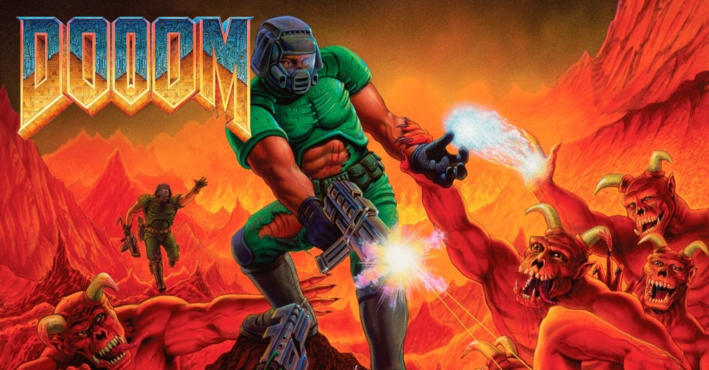

About
-----
This is a port of the iconic DOOM video game to the original Xbox system for the [DEFCON 27 CTF finals](https://www.oooverflow.io/dc-ctf-2019-finals/), which took place on August 9th-11th, 2019. Each of the 16 teams received an Xbox which ran a copy of this game in networked multiplayer deathmatch mode, with the challenge being to hack the game itself to become the reigning **King of the Hill**.

This port is based on the [chocolate-doom](https://www.chocolate-doom.org) project. The maps used for gameplay come from the [freedoom](https://freedoom.github.io/) project. The open-source Xbox toolchain [nxdk](https://github.com/xboxdev/nxdk) is used to build the client executables.

Gameplay & Challenge
--------------------
Each team receives an Xbox that has been previously soft-modded in order to be able to run unsigned code. Each Xbox is connected to the CTF network. When an Xbox is powered on, it automatically boots into a deployment agent which connects to a central deployment server which pushes the game executable/data to the Xbox and then commands the agent to launch the game executable. Upon launching, the game executable will immediately attempt to connect to the central game server to join a match.

The central game server periodically launches fixed-duration matches which clients can join within a 60 second window before the match begins. It is possible for none, some, or all teams to join a given match. The central server accepts only one connection per team. Teams cannot join a match once it begins. When the match begins, each player (1 per team) enters the game and can begin playing. When the match time limit expires, the game reboots the Xbox, going back to the deployment agent to get ready for the next match.

The style of gameplay is "King of the Hill" in which players must navigate to and control a special area of the map to score points. Players can defend the hill by using their weapon to eliminate other players. However, two limitations are placed in the game to incentivize players to start hacking:
1. Players cannot use their weapon until they bypass a simple check, and
2. Players cannot score points until they change their name from "sheep" (default) to their team name.

Additional points can be scored if players discover other hidden secrets in the game (see below).

The deployment agent performs no encryption or verification of the game executable/data. Players are expected to MITM the network connection between the central deployment server and their Xbox to capture the game executable and data. There are several RE tools with support for the XBE executable format used on the Xbox, so it is expected that teams can get up and running relatively quickly. Players are expected to discover the limitations mentioned above and patch them. Finally, the player can re-deploy their modified game executable back to the Xbox before the next match begins.

CTF Changes
-----------
A number of changes were made to the stock chocolate-doom game which break compatibility with stock servers/clients, including:
* Random padding, type, order, and magic changes to intentionally break protocol compatibility
* Slight changes to moving speed (which causes desync)
* Removal of hexen/strife protocol data
* Game communication takes place over TCP instead of UDP (to more easily integrate with the existing CTF infrastructure)

To support the 16 player KoH style gameplay, the following changes were made:
* Increase from max of 4 players to 32 (though limited to 16+Server for this CTF)
* Players score points when they enter a special section of the map and have changed their name from "sheep"
* Players are unable to use their weapon (until they patch the binary)
* Players can heal themselves with new "healing" field in game tick
* Game will not end when players desync

Additional secret changes:
* Players can pass through walls if they can turn at a rate of 1337. Hidden rooms were placed in the map which players could access using this secret. (*Note: players who enable clipping generally will not benefit from this, as the server-side game state representation still calculates player position to be bound by walls!*)
* Clients will disconnect after a fixed length time, but the server actually stays active for a bit longer. Players who patch this out can score extra points by remaining in the game until the server actually closes while peers disconnect.

How to Build the Client
-----------------------
The Xbox executable and WAD file is built within a Docker container. Clone and build with:

    git clone --recursive -j8 ssh://git@github.com/mborgerson/dc27-dooom.git && pushd dc27-dooom && ./build.sh

How to Build the Server
-----------------------
The game server runs natively on your server machine. It can be Dockerized, but that's not the case in this repo. Install dependencies with something like:

    sudo apt install cmake build-essential libsdl2-dev libsdl2-net-dev libsdl2-mixer-dev
    
Build with:

    mkdir -p doom/build_server
    pushd doom/build_server
    cmake .. -DSERVER=1
    make -j
    popd

Note: for testing, desktop builds can also connect to the game server. It's not strictly necessary to run on an Xbox.

How to Run
----------
You'll want to run a server and a client.

### Running the Server
If you are running with a real Xbox, you will need to run a DHCP server (e.g. udhcpd) on the network. Lease IPs in 10.2.110.*XYZ*. Have the main server run at 10.13.37.10. If you're using the agent, run the agent/server.py script to deploy the game to clients. Start the main game server with:

    ./doom/build_server/src/chocolate-doom -iwad ./bin/freedm.wad -nomonsters -deathmatch -warp 01 -server -port 2342

Note: the automation script which controlled launching/ending the matches and scoring points is not included in this repo, however the executable will print when a player is scoring points. To begin the match, enter " \n" ([space] + [enter]) to the server's stdin.

### Running the Client
You'll need to be able to run unsigned code, which you can do via [soft-modding](https://github.com/Rocky5/Xbox-Softmodding-Tool). You can also run this using XQEMU, but you'll want to disable the red pills in drm.h. Optionally use the deployment agent, or launch the game executable directly.

Repo Layout
-----------
* **agent**: the initial executable which runs when the Xbox turns on.
* **doom**: submodule fork of [chocolate-doom](https://www.chocolate-doom.org/wiki/index.php/Chocolate_Doom) (open-source DOOM game code) with changes for the Xbox port + CTF changes
* **freedoom**: submodule fork of [freedoom](https://freedoom.github.io/) (open-source levels) with DC27 flavor added
* **nxdk**: submodule to a fork of [nxdk](https://github.com/xboxdev/nxdk) (open-source Xbox toolchain) with minor patches

Scripts
-------
Some helpful scripts for building, deploying, and testing:
* **build.sh**: Build the client/wad using a Docker container
* **run.sh**: Fire up instances of XQEMU to test with
* **deploy_to_xbox.sh**: Ship the game over to your Xbox via FTP (may need to update paths/IP)

Debugging
---------
The build system will generate a .gdbinit file for you to launch gdb directly from this directory to begin debugging. Launch XQEMU with `-s` to host a gdb server.
